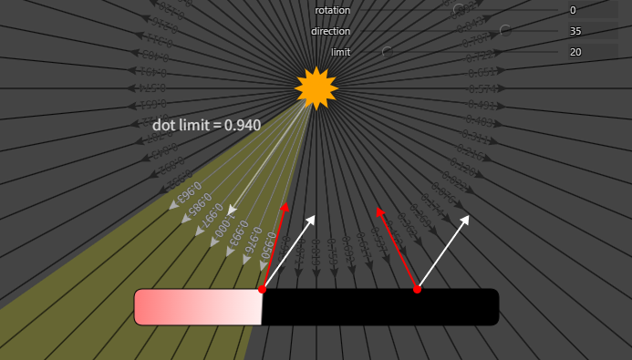
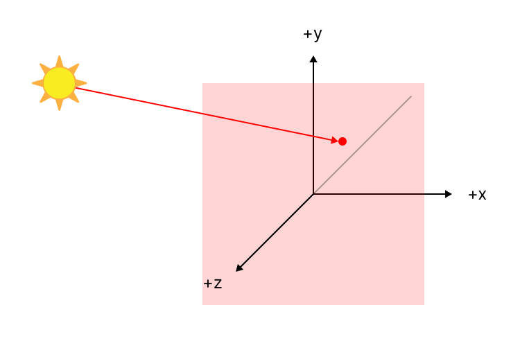
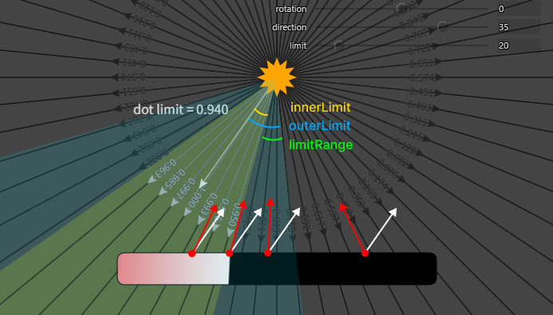
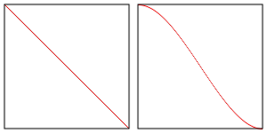

# スポットライト

https://webgpufundamentals.org/webgpu/lessons/ja/webgpu-lighting-spot.html

## スポットライト

点光源では、光源位置からすべての方向に光が進んでいた。\
スポットライトでは、この方向を制限する（照射範囲を決める）。

照射範囲は、「ライトの向き`lightDirection`とオブジェクト表面からライトへ向かうベクトル`surfaceToLightDirection`の内積（ベクトルを正規化しているのでcos）」と「制限値（cos）」を比較することで決めることができる。



```wgsl
let dotFromDirection = dot(surfaceToLightDirection, -uni.lightDirection);

if (dotFromDirection > uni.limit) {
  light = dot(normal, surfaceToLightDirection);
  specular = dot(normal, halfVector);
  specular = select(0.0, pow(specular, uni.shininess), specular > 0.0);
}
```

```ts
views.limit[0] = Math.cos(degToRad(settings.limit))
```

### ライトの向き

サンプルでは、`aim`マトリクス関数を使って求めている。

```ts
// カメラ
const target = [0, 35, 0]
const up = [0, 1, 0]
// ライトの位置
views.lightWorldPosition.set([-10, 30, 100])

const mat = mat4.aim(views.lightWorldPosition, [target[0] + settings.aimOffsetX, target[1] + settings.aimOffsetY, 0], up)
views.lightDirection.set(mat.slice(8, 11))
```



`aim`マトリクスにおけるZ軸は、ターゲットに向かう正規化されたベクトルなので、そのまま`lightDirection`となる

## 半影（penumbra）

ペナンブラ（penumbra）とは、もともと日食などの「半影」を意味する天文学用語。

上記までのスポットライトは、ライト境界ではっきりと明暗が分かれている。\
これを半影でぼかすには、`Limit`を`innerLimit`と`outerLimit`に分けて以下の条件で明暗をつける。

$$
\begin{equation}
  inLight=
  \begin{cases}
    1      & \text{$x < innerLimit$} \\
    (0, 1) & \text{$innerLimit \le x \le outerLimit$} \\
    0      & \text{$outerLimit < x$}
  \end{cases}
\end{equation}
$$



コードは以下のようになる。

```wgsl
let dotFromDirection = dot(surfaceToLightDirection, -uni.lightDirection);
let limitRange = uni.innerLimit - uni.outerLimit;
let inLight = saturate((dotFromDirection - uni.outerLimit) / limitRange);
```
```ts
views.innerLimit[0] = Math.cos(degToRad(settings.innerLimit))
views.outerLimit[0] = Math.cos(degToRad(settings.outerLimit))
```

- `saturate`は、`0 ~ 1`にclampする関数


線形な変化をさせる代わりに、`smoothstep`関数をつかって非線形な変化（エルミート補間）をさせることもできる。

```wgsl
let inLight = smoothstep(uni.outerLimit, uni.innerLimit, dotFromDirection);
```

